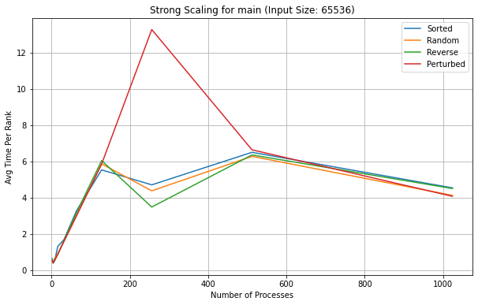
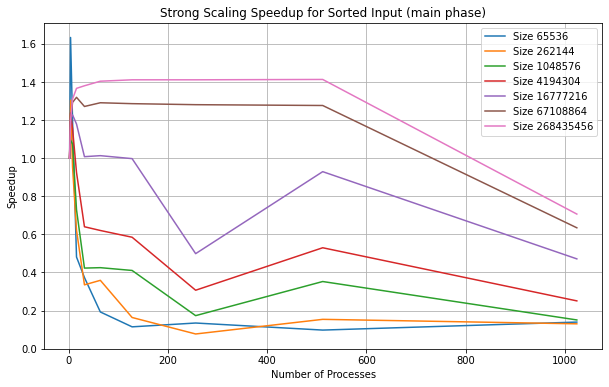
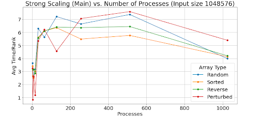

# CSCE 435 Group project

## 0. Group number: 22

## 1. Group members:
1. Gohyun Kim
2. Simon Sprouse
3. Michael Nix
4. Austin Karimi

## 2. Project topic (e.g., parallel sorting algorithms)

### 2a. Brief project description (what algorithms will you be comparing and on what architectures)

- Bitonic Sort - Simon Sprouse
- Sample Sort - Michael Nix
- Merge Sort - Gohyun Kim
- Radix Sort - Austin Karimi

How we will communicate: Discord
What versions do you plan to compare: An array that is sorted, unsorted, randomized. How time to calculate differs based on number of processes.

This project will compare the performance of four parallel sorting algorithms: Bitonic Sort, Sample Sort, Merge Sort, and Radix Sort. 
These algorithms will be implemented on different architectures to evaluate their scalability, speedup, and suitability for various data sets 
and computing environments such as testing on different processes, tasks per node.

### 2b. Pseudocode for each parallel algorithm
- For MPI programs, include MPI calls you will use to coordinate between processes

#### Bitonic Merge Steps:

1. Create MPI distribution
- Determine number of processes
- Receive master data
- MPI_init()
- MPI_comm_size()
- MPI_comm_rank()

2. Divide data to processes
- MPI_scatter()
- Each process also gets told a direction to sort

3. All processes sort their initial array 
- Quick sort on local array
- Must know the direction to sort (asc or desc)

4. Process Bitonic merge with neighbor process
- i vs i+k comparison between both arrays
- Recursive bitonic merge call on local array
- Sort local array
- MPI_sendrecv()

5. Gather data from processes
- Local data should be bitonically sorted
- MPI_gather()

6. Finalize process
- MPI_finalize()

#### Sample Sort:
Note:
- The fastest sorting algorithm should be used for the sequential internal sorting. Quick Sort is the most common algorithm for this, but Insertion Sort would be faster for smaller arrays. e.g. When the number of processors is large enough to make it reasonable
- Despite this, I will only include Quick Sort in the pseudo-code due to the testing required to find the cut-off required to make Insertion Sort useful 

parameters: 
- Unsorted array (arr)
- number of processors (p)
1. Initialize MPI environment
- MPI_Init()
- MPI_Comm_rank() to get rank of the process
- MPI_Comm_size() to get the number of processes

2. Split the array among processes
- num subarrays = number of processes
- get each local subarray's size (using MPI_Comm_size)
- allocate memory for each local subarray
- MPI_Scatter(...)

3. Sort the local arrays 
- QuickSort(subarray) //see below

4. Select local samples
- From each subarray, place p-1 values into a sample-array 
    - each value is evenly spaced in the parent sub-array

5. Gather the local samples
- if rank == 0: allocate space for all the samples
- MPI_Gather(local samples)

6. Sort the collected samples (master process)
- sorted samples = QuickSort(gathered samples)

7. Create splitter array (master process)
- splitters = []
- for i in [1..p-1]: splitters += sorted samples[i*p]

8. Broadcast splitters
- MPI_Bcast(splitters)

9. Split local arrays into buckets (based on splitters)
- buckets = 1xp array
- for each item in local array:
    find the bucket for the item
    append the item to buckets array

10. Send and receive the buckets to the corresponding processes
- MPI_Alltoall(...) to share the number of sends and receiving values
- MPI_Alltoallv(...) to share the values

11. Sort received buckets locally
- QuickSort(received buckets)

12. Gather sorted subarrays at master
- MPI_Gather(local sorted arrays)
- MPI_Finalize()

13. Return (master)
- if rank == 0 return sorted

QuickSort(arr): //sequential quicksort
- Choose a pivot
- Split arr into 3 partitions
    - a = values less than the pivot
    - b = the pivot
    - c = values greater than the pivot
- prev = QuickSort(a)
- next = QuickSort(c)
- return a + b + c

#### Merge Sort:

1. Create MPI distribution
- Determine number of processes
- Receive master data
- get number of processes with MPI_Comm_size()
- get current process rank using MPI_Comm_rank()
- if rank == 0:
-   initalize unsorted array

2. Divide data to processes
- Calculate subarray size, n / num_processes
- have each worker compute the subarray using MPI_Scatter()

3. All processes sort each subarray 
- call merge_sort(subarray, left, right)
- find mid point pivot
- call merge_sort(subarray, left, mid)
- call merge_sort(subarray, mid + 1, right)
- merge all subarrays
- merge(subarray, left, mid, right)
- merge each subarray into halves into a temp array
- copy remaining elements from left half and right half
- copy the merged elements back to the original array

4. Merge across processes
- Initialize step = 1 for representing the distance between neighboring processes involved in merging their sorted arrays
- while (step < num_processes): 
-   if (the current process should receive data):
-       if (neighboring process exists):
-           Receive sorted array from process using MPI_Recv()
-           Merge recerived array with the subarray
-   else
-       Send subarray to process using MPI_Send()
-       break
-   step *= 2

5. Combine merged arrays at the master process
- MPI_Gather() to receive all subarrays
- if rank == 0:
-   print(sorted_array)

6. Synchronize processes 
- MPI_Barrier() to ensure all processes have completed sorting 

7. Finalize processes
- Finalize MPI environment using MPI_Finalize()

#### Radix Sort:

Radix Sort: 

        
1. Initialize MPI 
- Get the total number of processes with MPI_Comm_size() (num_procs) 
- Get the rank of current process with MPI_Comm_rank() (rank)

2. Divide data
- if rank == 0 then 
    - Generate or read the input data 
    - Split the input data into sections for each process 
    - Scatter the sections to all processes using MPI_scatter()
- Else
    - Receive the section of data 

3. Perform radix sort
- function Local_Radix_Sort(chunk): 
    - Determine the maximum number of digits (max_digits) in the data
    - for digit from least significant to most significant do
        - Initialize empty buckets (0 to 9) for current digit
        - for each number in the section do 
          - Find the current digit of the number 
          - Place the number in corresponding bucket 
        - end for 
        - Reassemble the section by concatenating all the buckets in order (0 to 9) 
    end for 
    - return the sorted section
   
4. Data exchange
- for each digit from least significant to most significant:
    - Count the occurrences of each digit in local data (local_histogram) 

- Perform MPI_Alltoall to share local_histograms with all processes (global_histogram) 

- Compute the send_counts and receive_counts based on global_histogram 

- Prepare the data to send based on current digit and send_counts 
- Use MPI_Alltoallv for interprocess exchange (redistribute data)

- Update the local_data with received data

5. Gather sorted data in master process
- if the rank == 0 then 
    - Gather the sorted data sections from all processes and Combine sections into a final sorted array 
- else 
    - Send the sorted section to the root process 

- Finalize MPI

### 2c. Evaluation plan - what and how will you measure and compare
- Input sizes will all be powers of 2 (necessary for Bitonic Sort)
- Input types will all be int
- We plan to have Small, medium and large input sizes where we will measure the total execution time, and send/receive times.
- We will utilize different datatypes, with Sorted, Sorted with 1% perturbed, Random and Reverse sorted where we will also measure sorting time and send/receive time to observe how different input types impact performance.
- We will analyze how close the algorithms come to ideal strong scaling and identify bottlenecks (like communication overhead) as the number of processors increases.
- We will evaluate how well the algorithms maintain performance as the problem size grows, looking at any increases in execution time that could be due to communication overhead or memory usage as more processors are added.

### 2d. Implementation Description

# Mergesort:
- Initialize MPI environment 
- Get rank and processes
- Initialize array given the size at the master process
- Divide data into chunks and MPI_Scatter() to distribute the data into subarrays
- Sort each subarrays using the merge_sort() function
- MPI_Gather() all sorted subarrays in the master process
- Merge all subarrays into one using merge_sort()
- check() to make sure the final array is sorted
- MPI_Barrier to synchronize all processes
- Finalize MPI environment

# Samplesort:
- Initialize MPI Environment
- Generate Data
- Sort the Data on each processor
- Select equally spaced samples
- Gather the samples, and sort them
- Select pivots from the samples
- MPI_Bcast pivots
- partition based on pivots
- Redistribute data MPI_Alltoall & MPI_Alltoallv
- Final Sort
- Correctness Check
- Finalize

# Radixsort:
- Initialize MPI Environment
- Collect Metadata
- Generate the Arrays (sorted, unsorted, reverse, perturbed)
- Instantiate master process
- Find largest value in array and bit length
- Partition data in sections to different processes (distribute_data)
- Inside of workers partition array values into vectors by current bit (0 or 1)
- send data back to master to gather_results
- Receive worker vectors and edit input array
- Repeat for all bit digits in maximum arrray value 
- Send termination signal to worker processes indicating end of sort
- Correctness Check
- Finalize
### 3a. Caliper instrumentation

# MPI Mergesort Tree (2^16, 32)
1.669 main
├─ 0.000 MPI_Init
├─ 0.031 main
│  ├─ 0.001 data_init_runtime
│  ├─ 0.024 comm
│  │  └─ 0.024 comm_large
│  │     ├─ 0.022 MPI_Scatter
│  │     └─ 0.001 MPI_Gather
│  ├─ 0.001 comp
│  │  └─ 0.001 comp_large
│  └─ 0.000 correctness_check
├─ 0.028 MPI_Barrier
├─ 0.000 MPI_Finalize
├─ 0.000 MPI_Initialized
├─ 0.000 MPI_Finalized
└─ 0.001 MPI_Comm_dup

# MPI Samplesort Tree (2^16, 4 Processors)
0.421 main
├─ 0.001 MPI_Comm_dup
├─ 0.000 MPI_Comm_rank
├─ 0.000 MPI_Comm_size
├─ 0.000 MPI_Finalize
├─ 0.000 MPI_Finalized
├─ 0.389 MPI_Init
│  └─ 0.000 MPI_Init
├─ 0.000 MPI_Initialized
├─ 0.012 comm
│  ├─ 0.004 comm_large
│  │  ├─ 0.001 MPI_Alltoall
│  │  │  └─ 0.001 MPI_Alltoall
│  │  └─ 0.004 MPI_Alltoallv
│  │     └─ 0.004 MPI_Alltoallv
│  └─ 0.008 comm_small
│     ├─ 0.003 MPI_Bcast
│     │  └─ 0.003 MPI_Bcast
│     └─ 0.004 MPI_Gather
│        └─ 0.004 MPI_Gather
├─ 0.010 comp
│  ├─ 0.010 comp_large
│  └─ 0.000 comp_small
├─ 0.003 correctness_check
│  ├─ 0.001 MPI_Allreduce
│  ├─ 0.001 MPI_Recv
│  └─ 0.000 MPI_Send
└─ 0.001 data_init_runtime

# MPI Radixsort Tree (2^10, 4)
0.386 main
├─ 0.000 MPI_Init
├─ 0.000 data_init_runtime
├─ 0.005 comp
│  └─ 0.006 comp
│     ├─ 0.004 MPI_Recv
│     ├─ 0.001 MPI_Bcast
│     └─ 0.000 MPI_Send
├─ 0.005 comm
│  ├─ 0.001 MPI_Send
│  └─ 0.003 MPI_Recv
├─ 0.001 MPI_Bcast
├─ 0.001 MPI_Barrier
├─ 0.000 MPI_Send
├─ 0.000 MPI_Finalize
├─ 0.000 correctness_check
├─ 0.000 MPI_Initialized
├─ 0.000 MPI_Finalized
└─ 0.001 MPI_Comm_dup

### 3b. Collect Metadata

# Mergesort
           cali.caliper.version  mpi.world.size  \
profile                                           
2700912136               2.11.0              16   

                                                 spot.metrics  \
profile                                                         
2700912136  min#inclusive#sum#time.duration,max#inclusive#...   

           spot.timeseries.metrics  spot.format.version  \
profile                                                   
2700912136                                            2   

                                                 spot.options  spot.channels  \
profile                                                                        
2700912136  time.variance,profile.mpi,node.order,region.co...  regionprofile   

           cali.channel spot:node.order          spot:output spot:profile.mpi  \
profile                                                                         
2700912136         spot            true  p16-a268435456.cali             true   

           spot:region.count spot:time.exclusive spot:time.variance  \
profile                                                               
2700912136              true                true               true   

            launchdate                                          libraries  \
profile                                                                     
2700912136  1729135817  [/scratch/group/csce435-f24/Caliper/caliper/li...   

                             cmdline cluster algorithm programming_model  \
profile                                                                    
2700912136  [./mergesort, 268435456]       c     merge               mpi   

           data_type  size_of_data_type  input_size input_type  num_procs  \
profile                                                                     
2700912136       int                  4   268435456     Random         16   

           scalability  group_num implementation_source  
profile                                                  
2700912136        weak         22                online 

# Radixsort

algorithm	programming_model	data_type	size_of_data_type	input_size	input_type	num_procs	scalability	group_num	implementation_source
node	profile																										
{'name': 'main', 'type': 'function'}	678431665	1.0	regionprofile	0.385602	0.385948	0.385807	1.543228	0.000000	0.376337	0.378955	0.377598	1.510390	NaN	NaN	NaN	NaN	main	binary_radix_sort	mpi	int	4	1024	0	4	strong	22	online/ai/handwritten
{'name': 'MPI_Init', 'type': 'function'}	678431665	2.0	regionprofile	0.000029	0.000038	0.000035	0.000140	0.000000	0.000029	0.000038	0.000035	0.000140	1.0	1.0	1.0	4.0	MPI_Init	binary_radix_sort	mpi	int	4	1024	0	4	strong	22	online/ai/handwritten
{'name': 'data_init_runtime', 'type': 'function'}	678431665	3.0	regionprofile	0.000056	0.000056	0.000056	0.000056	0.000000	0.000056	0.000056	0.000056	0.000056	1.0	1.0	1.0	1.0	data_init_runtime	binary_radix_sort	mpi	int	4	1024	0	4	strong	22	online/ai/handwritten
{'name': 'comp', 'type': 'function'}	678431665	4.0	regionprofile	0.000019	0.007306	0.004833	0.019333	0.000008	0.000019	0.000021	0.000020	0.000080	1.0	1.0	1.0	4.0	comp	binary_radix_sort	mpi	int	4	1024	0	4	strong	22	online/ai/handwritten
678431665	16.0	regionprofile	0.005921	0.007286	0.006418	0.019253	0.000000	0.000915	0.000959	0.000943	0.002828	1.0	1.0	1.0	3.0	comp	binary_radix_sort	mpi	int	4	1024	0	4	strong	22	online/ai/handwritten

# Samplesort
        nid	spot.channel	Min time/rank	Max time/rank	Avg time/rank	Total time	Variance time/rank	Min time/rank (exc)	Max time/rank (exc)	Avg time/rank (exc)	Total time (exc)	Calls/rank (min)	Calls/rank (avg)	Calls/rank (max)	Calls/rank (total)	name	input_type	num_procs	input_size
node	profile																			
{'name': 'main', 'type': 'function'}	25268110	1.0	regionprofile	0.421131	0.421189	0.421153	1.684613	0.000000	0.005771	0.006329	0.006039	0.024156	NaN	NaN	NaN	NaN	main	random	4	65536
54571212	1.0	regionprofile	1.990979	2.050741	2.036710	1042.795482	0.000055	0.005975	0.008107	0.006246	3.197957	NaN	NaN	NaN	NaN	main	random	512	262144
75260857	1.0	regionprofile	0.916840	0.918408	0.917623	7.340984	0.000000	0.011571	0.013058	0.012445	0.099559	NaN	NaN	NaN	NaN	main	one_percent_perturbed	8	4194304
96382717	1.0	regionprofile	0.795777	0.797730	0.796684	6.373469	0.000000	0.005941	0.006881	0.006292	0.050332	NaN	NaN	NaN	NaN	main	reverse_sorted	8	262144
134921820	1.0	regionprofile	1.933111	2.030326	1.982961	126.909528	0.001870	0.008893	0.023596	0.011446	0.732548	NaN	NaN	NaN	NaN	main	one_percent_perturbed	64	16777216
## 4. Performance evaluation

Include detailed analysis of computation performance, communication performance. 
Include figures and explanation of your analysis.

### 4a. Vary the following parameters

## Bitonic Sort

My implementation of Bitonic sort scales very well in the computation but very poorly in the communication. You can see that after a certain point, the extra overhead from the comm time reduces the efficiency. I believe that the array passing mechanism is the most expensive element that causes this. 

In the plots it is clear to see that the speedup scaling for main only ever reaches a maximum of 50x even when running 1024 processes. This suggests to me that there is a scalability issue with either the hardware, or the code could use some efficiency improvements. Ideally we would see more speedup here. 

I should also mention that grace stopped letting me submit jobs, but that's ok because Bitonic sort is independent of input ordering, and I have all the cali files for a single input order. 

Maybe this current version of Bitonic sort would be more usefull if the comparison method was significantly more intensive than the data broadcast. In this case, Bitonic sort is probably not worth the extra time and resources. 

## Merge Sort

Below are my graphs for Strong scaling for comp, comm and main. There are also speedup and weak scaling.
For the comp, it exponentially decreases as we add more processors. This makes sense since more workers are working to sort parts of the graph.
However, comm takes longer with more processors. With more communication to be done, it makes sense that the time to look into them takes longer.
My main is a little off because I marked my CALI stuff incorrectly. In addition, I believe that I didn't scale properly while running the jobs, which caused this error.
Same goes for the speedup, but it is generally follows a trend from top to bottom based on the array size.
Looking at each array size, however, the speedup scales nicely as it increases with more processors.
For the weak scaling, I increased the array size and processors and used that data to create the graph.
We should ideally see a flat line, and that is what we see here. We can see that the line scales scales very nicely as you increase processors and array size.

Strong Scaling (Comp):

Strong Scaling (Comm):

Strong Scaling (Main):

Speedup:

Weak Scaling:

# Sample Sort

Weak Scaling:

Strong Scaling:

# Radix Sort

I had some issues requesting 32 nodes sometimes so I was unable to run my sort on 1024 processes for a few arrays, but everything else ran quite smoothly. On average a direct scaling of computation time decrease as the number of processors increase can be seen as expected, with the average communication time increasing. The Strong Scaling for main represents a direct exponential decay relationship for the larger array sizes (2^28, 2^26 and 2^24)as you increase the number of processes but has quite a performance fall off as you get to smaller array sizes. This is likely due to the communication overhead and inefficiency as a function of the parallelization. This exponentially decreasing relationship remains consistent amongst all comp_large graphs for every array size, which makes sense since there is a direct relationship between computation time decreasing as you have more processors handling less amounts of data each. Generally, the weak scaling follows a flat linear relationship as you increas the processors relative to the input size, but for communication on the larger array sizes it appears to increase rapidly. The strong scaling speedup for communication shows a decreasing relationship as you increase the processor count, which makes sense because the overall communication time increases as the array size gets larger due to sending and receiving more data. The Strong Scaling speedup for main shows a Exponentially increasing relationship where the dropoff threshold increases as the array size increases, which makes sense because the larger array sizes can utilize more processor paralellization meanwhile the smaller array sizes experience an immediate performance dropoff due to the communication time outweighing the parallelized computation speed. Finally the Speedup for Comp_large shows a Directly increasing relationship where the plateau slowly increases as the array size increases  which is expected due to the increased effects of parallelization for the larger array sizes with more data to sort. 

For input_size's:
- 2^16, 2^18, 2^20, 2^22, 2^24, 2^26, 2^28

For input_type's:
- Sorted, Random, Reverse sorted, 1%perturbed

MPI: num_procs:
- 2, 4, 8, 16, 32, 64, 128, 256, 512, 1024

This should result in 4x7x10=280 Caliper files for your MPI experiments.

### 4b. Hints for performance analysis

To automate running a set of experiments, parameterize your program.

- input_type: "Sorted" could generate a sorted input to pass into your algorithms
- algorithm: You can have a switch statement that calls the different algorithms and sets the Adiak variables accordingly
- num_procs: How many MPI ranks you are using

When your program works with these parameters, you can write a shell script 
that will run a for loop over the parameters above (e.g., on 64 processors, 
perform runs that invoke algorithm2 for Sorted, ReverseSorted, and Random data).  

### 4c. You should measure the following performance metrics
- `Time`
    - Min time/rank
    - Max time/rank
    - Avg time/rank
    - Total time
    - Variance time/rank

## 5. Presentation
Plots for the presentation should be as follows:
- For each implementation:
    - For each of comp_large, comm, and main:
        - Strong scaling plots for each input_size with lines for input_type (7 plots - 4 lines each)
        - Strong scaling speedup plot for each input_type (4 plots)
        - Weak scaling plots for each input_type (4 plots)

Analyze these plots and choose a subset to present and explain in your presentation.

## 6. Final Report
Submit a zip named `TeamX.zip` where `X` is your team number. The zip should contain the following files:
- Algorithms: Directory of source code of your algorithms.
- Data: All `.cali` files used to generate the plots seperated by algorithm/implementation.
- Jupyter notebook: The Jupyter notebook(s) used to generate the plots for the report.
- Report.md
